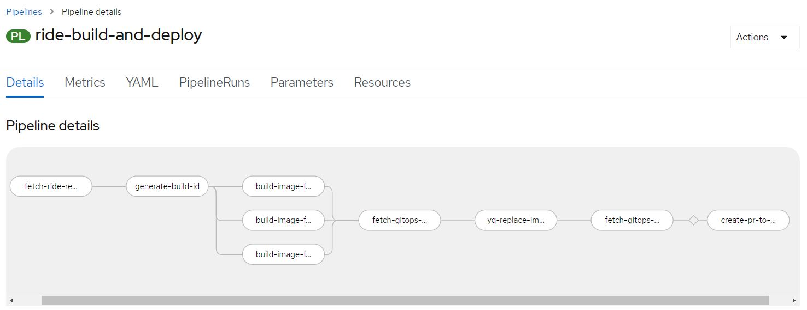
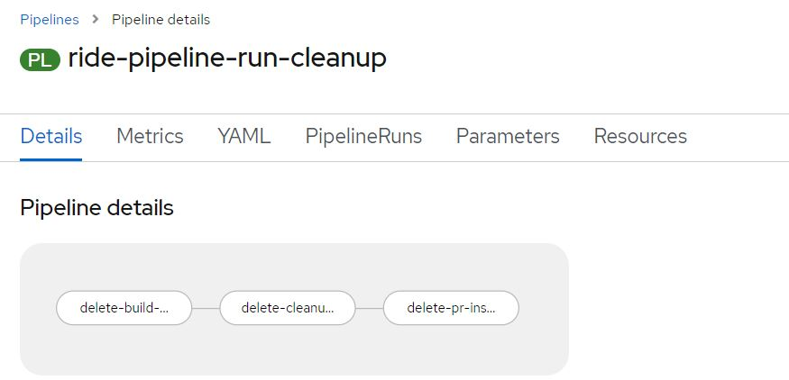

# RIDE
RIDE (RoadSafetyBC Integrated Digital Ecosystem) is the technical name for a suite of microservices that implement RoadSafetyBC's RIDE application.  
This repository contains the code, the how-to guides, and the build and deployment scripts needed to develop and run RIDE.

## 1. RIDE Application Context Diagram

Source: JPSS / ISB Wiki - [RoadSafetyBC RIDE-based Integration (Current and Possible Future State)](https://justice.gov.bc.ca/wiki/pages/viewpage.action?pageId=301400122)

## 2. RIDE Key URLs
* RIDE Common Console URL (Prod): https://ride.apps.silver.devops.gov.bc.ca/
* RIDE Build Pipeline (Prod): https://console.apps.silver.devops.gov.bc.ca/k8s/ns/be5301-tools/tekton.dev~v1beta1~Pipeline/ride-build-and-deploy
* RIDE Cleanup Pipeline (Prod): https://console.apps.silver.devops.gov.bc.ca/k8s/ns/be5301-tools/tekton.dev~v1beta1~Pipeline/ride-pipeline-run-cleanup
* RIDE Deployment (ArgoCD) URL: https://argocd-shared.apps.silver.devops.gov.bc.ca/

## 3. RIDE Component Types

* **Business Logic Service Component**: encapsulates the business logic of a given functionality (i.e.
defines the what).
* **Integration Adaptor Component**: contains the necessary integration logic required to interface
with a given partner system (i.e. the how)
* **Web Interface Component**: dashboarding, error mgmt., reports, admin tools & public facing portals (future).

## 4. RIDE Components Defined

This table summarizes the components that comprise the RIDE application.

| Component | Type | Description |
| --- | --- | --- |
| [rsbc-ride-kafka-evteventproducer](rsbc-ride-kafka-evteventproducer/README.md) | Business Logic Service | Accept business events sent from jh-etk system, and publish them to Kafka |
| [rsbc-ride-kafka-mockproducer](rsbc-ride-kafka-mockproducer/README.md) | Business Logic Service | Simulate kafka producer |
| [rsbc-ride-kafka-mockconsumer](rsbc-ride-kafka-mockconsumer/README.md) | Business Logic Service | Simulate kafka consumer |
| [Kafka (RedHat AMQ Strems)](https://access.redhat.com/documentation/en-us/red_hat_amq_streams/2.0/html/amq_streams_on_openshift_overview/index) | Event engine | Distributed event streaming platform. It's the core of RIDE. It is used by RSBC business areas for high performance data pipelines, data integration, streaming analysis, etc. |
| [Apicurio Service Registry](https://www.apicur.io/registry/) | Service Registry | It's a runtime system (server) that stores a specific set of artifacts (files). In the context of RIDE, it's used to store a set of kafka topic schemas. |

## 5. Directory Structure
| Folder / File | Content |
| --- | --- |
| policy/ | Network policy file that defines how to route traffic between namespaces and pods in be5301-* |
| rsbc-ride-kafka-evteventproducer/ | RIDE eVT business events producer (events published to Kafka) component folder |
| rsbc-ride-kafka-mockproducer/ | RIDE mock kafka events producer component folder |
| rsbc-ride-kafka-mockconsumer/ | RIDE mock kafka events consumer component folder |
| tekton/ | Folder contains RIDE specific tasks, triggers, and pipelines definition; which can be used to reproduce the pipeline. |
| README.md | This file |

## 6. Github flow
The two RIDE pipelines are both integrated with the Github events. To summarize it, there are below senarios:
### 1. When a new PR is opened, reopened, synchronize (i.e., changes are checked in):
A new PipelineRun instance of pipeline **ride-build-and-deploy** will start. A screenshot of this pipeline can be seen here: 

Tasks explanation:
| Task | Task description |
| --- | --- |
| fetch-ride-repo-to-build | Fetch the source code from the PR source branch of RIDE repo|
| generate-build-id | Generate an unique id which will be used later to tag the built images | 
| build-image-for-evteventproducer | Build a new image for rsbc-ride-kafka-evteventproducer component, and tag it using the id generated above. |
| build-image-for-mockconsumer | Build a new image for rsbc-ride-kafka-mockconsumer component, and tag it using the id generated above. |
| build-image-for-mockproducer | Build a new image for rsbc-ride-kafka-mockproducer component, and tag it using the id generated above. |
| fetch-gitops-repo-as-input | Fetch the source code from deployment/jag-rsbc-ride branch in [tenant-gitops-be5301](https://github.com/bcgov-c/tenant-gitops-be5301) repo, and stores the source code in the shared workspace. |
| yq-replace-image-tag | Update the PR deployment scripts against the source code fetched in the fetch-gitops-repo-as-input step. |
| fetch-gitops-repo-as-source-and-update | Pushes the code updates into deployment/jag-rsbc-ride branch in [tenant-gitops-be5301](https://github.com/bcgov-c/tenant-gitops-be5301) repo | 
| create-pr-to-master-branch | This task creates a new PR in [tenant-gitops-be5301](https://github.com/bcgov-c/tenant-gitops-be5301) repo. This task will only be executed if the PR target branch is master. |

### 2. When a PR is closed.
A new PipelineRun instance of pipeline **ride-pipeline-run-cleanup** will start. A screenshot of this pipeline can be seen here: 

Tasks explanation:
| Task | Task description |
| --- | --- |
| delete-build-pipelinerun-instance | Delete the historical pipelinerun instance of pipeline **ride-build-and-deploy**. Only keep 2 most recent piepelinerun instances |
| delete-cleanup-pipelinerun-instance | Delete the historical pipelinerun instance of pipeline **ride-pipeline-run-cleanup**. Only keep 2 most recent piepelinerun instances |
| delete-pr-instance | Delete all assets, e.g., deployment, pods, statefulsets, etc, that are associated with the PR that's closed. |

